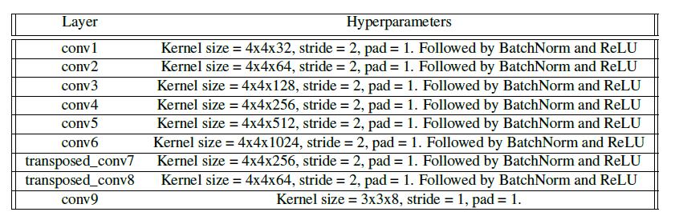

# YOLO
YOLO is an extremely fast real time multi object detection algorithm. In this project, I use 10K street scene images with correponding labels as training data. The image dimension is 128x128x3, and the labels include the semantic class and the bounding box corresponding to each object in the image.

#Network architecture

