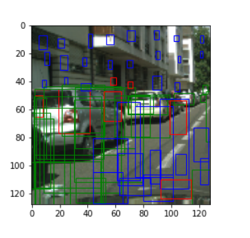

# YOLO
YOLO is an extremely fast real time multi object detection algorithm. In this project, I use 10K street scene images with correponding labels as training data. The image dimension is 128x128x3, and the labels include the semantic class and the bounding box corresponding to each object in the image.

## Network architecture

## Loss Objective

## Results 

### Ground Truth Image

### Raw Output from the Network (PreNMS)

### After Post Processing

### Visual inspection of Performance

### Loss Plots

### Average Precision

I observed that all the different components of losses go down in parallel. The loss came down to : range 7-15 , over 40 epochs, with a learning rate of 10e-4. 

The performance of the network could be improved in terms of speed if we could parallelize the AP calculation and Non-maximal suppression. 

Issues while training: I used a learning rate of 10e-3 and torch.exp after the last layer which resulted in an exploding gradients problem. It worked when I changed the learning rate to 10e-4. It also exposed a problem with using torch.exp as it did not constrain probability values of P(Objectness) and P(Class) within 0-1.

The performance could be improved if we trained for more epochs. If the training set was larger, we would better learn the underlying distribution.

